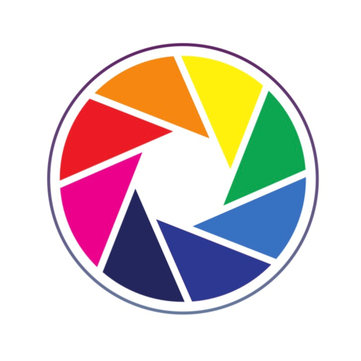

<!-- PROJECT LOGO -->

<h3>   My Colors  
     </h3>   

 
   

## Big Idea
Make an inclusive solution that helps people identifying colors

## Challenge Statement
helping people who are struggling with finding and identifying colors

## Solution Concept
An app for people who have hard time identifying colors and wishes there was a way to specify and save colors from real life so that they have reference palette

## Used Technologies 
- CoreData
- Image picker
- Color picker
- Accessibility (Voice over)
- UIKit

## Tools
[![SwiftUI][SwiftUI-img]][SwiftUI-url]   [![Sketch][Sketch-img]][Sketch-url]  
## Demo
<a href="https://drive.google.com/file/d/1-OTDphHr4CGZj1QLBFcD6ELSkvsfuVTj/view?usp=share_link"> App Demo </a> - 

## Challenge Summary

<h3>    

## Team

<a href="https://www.linkedin.com/in/roba-alghanmi-181224205/">Roba Alghanmi </a> - 
<a href="https://www.linkedin.com/in/rand-alhassoun-b067b91a3/">Rand Alhassoun </a>

<!-- MARKDOWN LINKS & IMAGES -->

<!-- https://www.markdownguide.org/basic-syntax/#reference-style-links -->

[SwiftUI-img]: https://img.shields.io/badge/-SwiftUI-blue

[SwiftUI-url]: https://developer.apple.com/xcode/swiftui/

[Sketch-img]: https://img.shields.io/badge/-Sketch-yellow

[Sketch-url]: https://www.sketch.com

